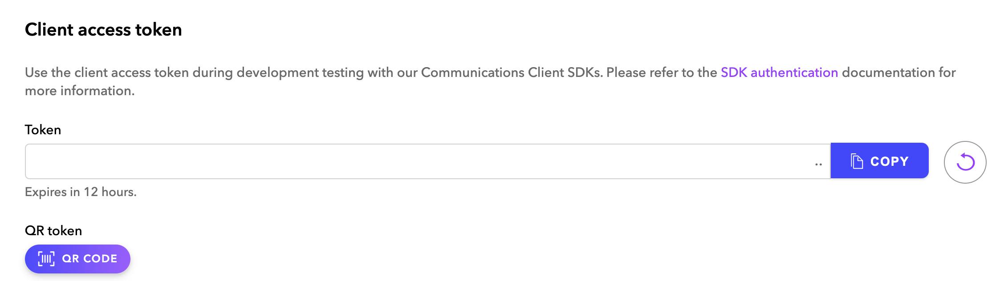
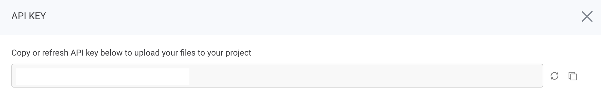

# Blog post - Audio Moderation in conference using Hive.ai and the Dolby.io iOS SDK

This repository contains a sample application for the blog post TODO ADD LINK. It allows you to use [Hive Audio Moderation](https://hivemoderation.com/audio-moderation) to capture raw local audio from Dolby.io conference, transcribe raw audio into human readable text, process the full transcription and detects inappropriate content across multiple classes.

## Requirements
If you do not have one already, create an account on Dolby.io and retrieve a client access token by connecting to your dashboard and selecting your application then click on API keys in the left menu.

Then, create a [Hive](https://thehive.ai) account if you do not have one already and [Request a Demo](https://hivemoderation.com/contact-us?source=hivemoderation-header)

When you have access to to your dashboard, create a project and get your `Hive API Key`.

## Run the application

1. Clone this repository to your local computer and open a project file with Xcode.
2. Make sure your project's **Bundle identifier** and **Team Account** is set for your developement environment.
   - Select the project's target and Signings and Capibilities Tab.
   - Select your team and set the project's bundle ID.
3. Update the Configuration.swift file with Dolby.io Client Access Token and Hive API Key.
4. Select your iOS Device and Run the project.